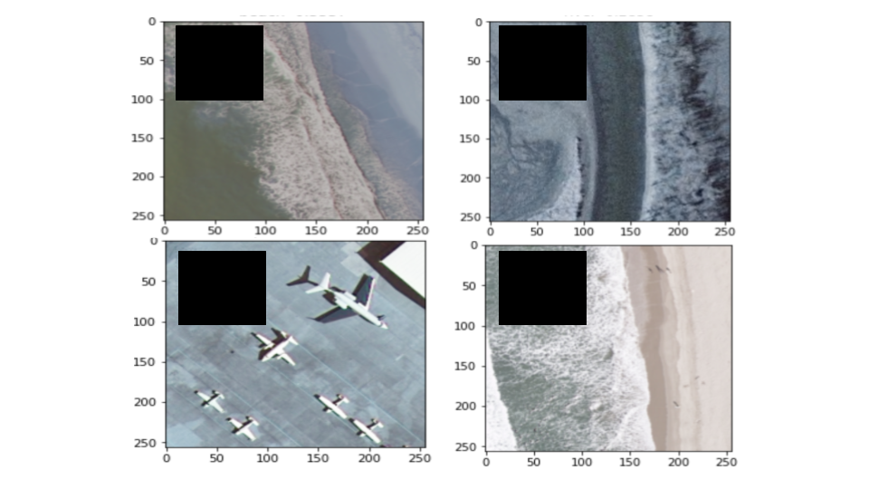

# Image Data Gap Filler

empty-image-filler is a python package that, given images that may contain missing data regions, returns these images with the regions filled. These regions of missing data are filled using a dynamic method that incorporates randomly chosen, non-null neighboring pixels.

Our command-line tool is intended to obscure regions of null or missing data from machine learning pattern-recognition algorithms. However, this package can be used to fill in an image's missing data or a given RGB value in the image for any purpose. More information on our work with this package can be found [here](https://drive.google.com/file/d/18LSWDsXX9PdDLoYNuzKGLzKUZEuGzAo_/view?usp=sharing).

## Installation

Here we detail how to install our package. [in progress]

## Usage

Here we explain how to use our package. [in progress]

### Functions
`fill_swath_with_random_rgb(img)` - Method 1. Selects pixel values from a random Gaussian distribution to fill missing pixel values.

`fill_swath_with_random_pixel_from_image_new(img)` - Method 2. Selects other pixel values from non-missing portions of the image to fill missing pixel values. 

|-- `get_random_pixel_from_image(x_arr, y_arr)` - Randomly selects non-swath-gap pixel from the image.

`fill_swath_with_neighboring_pixel(img)` - 

|-- `get_neighboring_pixel()` - 

### Arguments
The function arguments are as follows:
`img` - numpy array of input image in utf8 form.
`color ` - color of missing data to fill in (0 - black, 256 - white). Default is black. (Optional)
`current_window_size` - for adaptive nearest neighbors method (method 3), radius for selecting neighbor pixels. Default is 10 pixels. (Optional)

### Example

Below are some examples with missing data regions filled by our python function:

**Pre-fill:**


**Post-fill:**


## FAQs

#### What type of images can be used with the python package?

Our package works best if less than 25% of the image data is missing.

#### How does empty-image-filler recognize "missing data"?

By default, our code recognizes "missing data" as [0,0,0] RGB, i.e. black, pixels. However, the user has the option to change what RGB values are recognized as "missing data" by ..............

#### How has empty-image-filler been used?

Our code was created as a part of research done under SpaceML and alongside NASA's Impact Team. Our goal was to reduce the effects of swath gaps found in NASA Terra and Aqua satellite images in unsupervised machine learning. More information on our work can be found [here](https://drive.google.com/file/d/18LSWDsXX9PdDLoYNuzKGLzKUZEuGzAo_/view?usp=sharing).

## Citation

If empty_image_filler is useful in your research, please consider citing
```
@article{cao2020swathgaps,
  title={Reducing Effects of Swath Gaps in Unsupervised Machine Learning},
  author={Chen, Sarah and Cao, Esther and Koul, Anirudh and Ganju, Siddha and Praveen, Satyarth and Kasam, Meher Anand},
  journal={Committee on Space Research Machine Learning for Space Sciences Workshop},
  year={2021}
}
```

https://guides.github.com/features/mastering-markdown/
